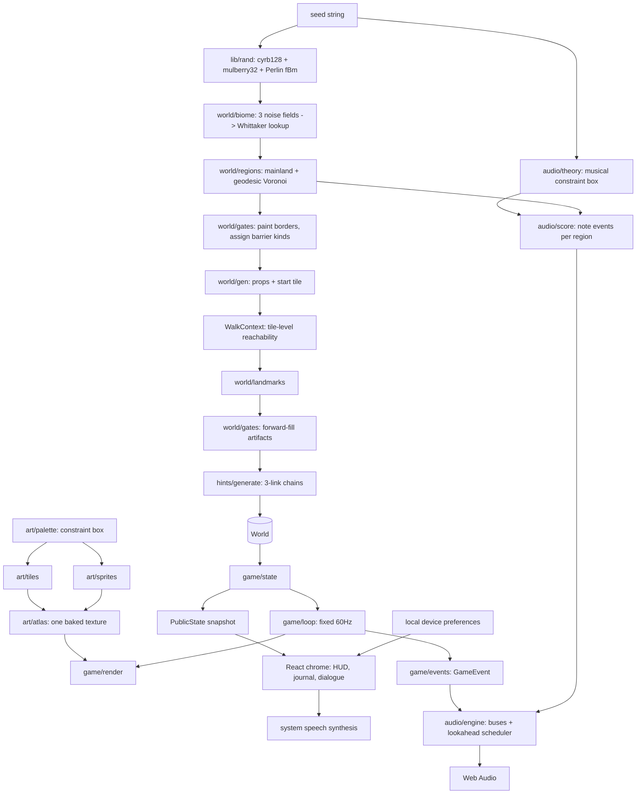

# Open Range Architecture

## Purpose

Open Range is a browser exploration game whose art and world are both generated
from a seed. It exists to solve one stated problem — terrain art that would not
hold a consistent look across biomes — by making coherence a property of the
generator rather than of curation.

Three concepts stay distinct:

- **Palette** constrains every colour the game can produce. Nothing draws with a
  literal colour.
- **World** is an immutable, pure function of a seed string: terrain, regions,
  gating, artifacts, landmarks, speakers.
- **Game state** is the small mutable layer on top: where the player stands, what
  they carry, what they have been told, what they have seen.

## System overview



Five layers:

1. **Art** — a constrained colour space, procedural tile and sprite painters, and
   a single atlas baked once at boot.
2. **World** — pure generation. Same seed in, byte-identical world out.
3. **Audio** — a constrained musical space and a composer, both pure; a scheduler
   on the audio clock that the frame loop never touches.
4. **Runtime** — fixed-timestep simulation, collision, camera, rendering.
5. **Presentation** — App Router routes and a thin React chrome that never
   participates in the frame loop.

Conversation narration belongs to presentation, not world generation or saved
game state. The opt-in setting is a local device preference. A single narration
controller owns system speech, cancels the previous utterance before speaking a
new dialogue line, and uploads no text or audio. Opening Settings participates in
runtime modal state so it pauses movement without discarding an open conversation;
that is what lets one settings panel serve the dialogue panel as well as the
lower-right control cluster. The panel is named `options` throughout the
simulation — the action, the state flag, the event and the `O` key all predate
the rename, and renaming them would reach into the loop, the input layer and the
audio engine to change a word nobody sees.

Fog darkness is a presentation preference too, but the renderer sits inside the
frame loop where React state cannot reach. It crosses that boundary through a
ref, the same way the audio engine does, while React keeps its own copy for the
slider. `render()` takes the setting as a parameter and maps it onto an alpha
itself, so the stored value stays abstract and the mapping can change without
invalidating what players have already chosen.

## Repository layout

| Path | Responsibility |
| --- | --- |
| `lib/rand.ts` | Seeded PRNG, gradient noise, fBm, stable coordinate hash, content hash |
| `lib/art/palette.ts` | The constraint box, biome ramps, accents, UI and sprite colours |
| `lib/art/tiles.ts` | 16×16 terrain painters and directional transition bands |
| `lib/art/sprites.ts` | Characters, artifacts, landmarks, props |
| `lib/art/font.ts` | 5×8 pixel font defined in code, for the social card |
| `lib/art/canvas.ts` | Surface creation and the shared outline post-pass |
| `lib/art/atlas.ts` | Shelf-packs every drawable into one texture |
| `lib/world/biome.ts` | Elevation, moisture, temperature → biome per tile |
| `lib/world/regions.ts` | Mainland selection, geodesic Voronoi, adjacency, naming |
| `lib/world/gates.ts` | Barrier painting, tile reachability, forward fill |
| `lib/world/landmarks.ts` | Named, recognisable features that hints can point at |
| `lib/world/names.ts` | Syllable grammar for regions, artifacts, people |
| `lib/world/gen.ts` | `generateWorld(seed)` — the single pure entry point |
| `lib/hints/grammar.ts` | Hint sentence templates |
| `lib/hints/generate.ts` | Speakers and three-link chains |
| `lib/audio/theory.ts` | The musical constraint box: collection, rotations, shared contour and rhythm |
| `lib/audio/score.ts` | `composeRegion(seed, region)` — note events for one region |
| `lib/audio/cues.ts` | In-key motifs for game events |
| `lib/audio/clock.ts` | The lookahead scheduler's decision function |
| `lib/audio/offline.ts` | Software renderer, for the headless preview |
| `lib/audio/{context,synth,reverb,engine}.ts` | The only files that touch Web Audio |
| `lib/game/events.ts` | `GameEvent` — what the loop reports, in world vocabulary |
| `lib/game/preferences.ts` | Device-local settings, deliberately outside the world save |
| `lib/game/*` | State, input, loop, render, save |
| `components/title-screen.tsx` | Landing hierarchy, saved-game actions, optional seed entry, audio priming |
| `components/options-menu.tsx` | Every preference in one panel — `options` in code, "Settings" on screen |
| `components/use-game-audio.ts` | Browser audio lifecycle, preferences and game-event bridge |
| `components/*` | Canvas host and the remaining React chrome |
| `app/layout.tsx` | Absolute `metadataBase`, Open Graph and Twitter metadata |
| `scripts/canvas-shim.ts` | Software Canvas2D, enough to run the art pipeline in Node |
| `scripts/png.ts` | Minimal PNG encoder for the preview renderers |
| `scripts/wav.ts` | Minimal 16-bit PCM WAV encoder, its sibling |
| `scripts/render-art-preview.ts` | The coherence checkpoint, as a PNG |
| `scripts/render-world-preview.ts` | Island map plus a close-up, as a PNG |
| `scripts/render-og-image.ts` | The social card and terrain-only landing hero |
| `scripts/render-score-preview.ts` | The coherence checkpoint for music: piano roll, or a WAV tour |
| `public/{og,hero}.png` | Committed 1200×630 views of one generated world frame |

## The constraint box

`palette.ts` is the load-bearing file. Hue is confined to an earthy arc,
saturation is capped, lightness follows one curve shared by all biomes, and a
single atmosphere hue is mixed into everything — more strongly at the light end,
the way distance and sunlight tint a landscape.

A biome supplies a hue, a saturation and a lightness **offset**. Two consequences:

- Two biomes have identical internal contrast, because neither owns its curve.
- An off-style tile is not a mistake that can be made.

The atmosphere pull interpolates *linearly within* the hue band. Both endpoints
are inside a contiguous arc, so the result provably cannot leave it.

Biomes may declare an **accent** hue for small details — heather on a moor,
wildflowers in grass, blue shadow on snow. Accents resolve through the same box.
This is what lets a moor be olive-brown ground with purple flecks; making heather
the base hue produced lavender ground that clashed with every other biome.

## Tile drawing

Two rules keep the world from reading as a grid of coloured squares:

1. **Interiors are flat plus small marks, never a gradient.** A per-tile gradient
   cannot line up with its neighbour and the seams become a visible lattice.
2. **All blending happens in edge overlays** — a dithered band drawn in the
   *neighbour's* ramp, entering from one of four directions, with precedence from
   `TileSpec.rank`. Four masks per biome, not sixteen per biome pair; corner tiles
   simply receive two overlays.

Variants are selected by a stable hash of `(x, y)`, so terrain never shimmers as
the camera moves. The atlas is byte-identical on every machine.

## World generation order

```
terrain → mainland → regions → gates → props → start tile → landmarks → artifacts → speakers
```

The order is not arbitrary:

- **Props and the start tile precede artifacts**, because both change what is
  walkable and therefore where a key may legally be hidden.
- **Landmarks precede artifacts**, so an artifact can be anchored beside one. That
  is what makes "beneath the split oak" true by construction rather than something
  checked and repaired afterwards.
- **Artifacts precede speakers**, so each clue describes a location that exists.

Only the largest connected component of walkable land is used. Noise readily
produces offshore specks; as regions they would claim reachability that does not
exist. If the island is too small to host a progression, generation retries with
a derived seed (`seed#1`, `seed#2`, …) — still a pure function of the original.

Region territories grow by **multi-source breadth-first search**, not Euclidean
distance. Euclidean Voronoi cuts straight across bays, placing tiles in a region
unreachable from its own centre; growing by walking distance makes every region
internally connected by construction.

## Gating

The **entire border** between two regions is painted with one barrier terrain
(river, cliff, or bramble). This makes region-graph adjacency and actual walking
equivalent: there is no chokepoint to place and no gap for noise to leave open.
The first painted layer is always solid; layers beyond it are applied unevenly by
coordinate hash, so a border reads as a river or a ridge rather than a surveyed
canal.

Barrier kind comes from the **deeper** of the two regions' progression batches, so
entering a batch-*k* region always costs artifact *k* regardless of approach. Using
the shallower side left a back door.

Batches are assigned from breadth-first **order**, not breadth-first **depth**.
Depth seemed natural but fails: seven regions in a geodesic Voronoi form a dense
planar graph whose depth from any start is often only one or two, which silently
collapsed a three-artifact progression into one or two. Order always yields three
non-empty batches.

## Reachability is computed on tiles

This is the most important correctness decision in the project.

Reachability looked like it could be read off the region graph — borders are
painted in full, so crossing regions always means crossing a barrier. It cannot.
**Painting a border two tiles deep on both sides can cut a narrow region's
passable interior into disconnected pockets.** The graph still calls that region
reached, while a player standing in one pocket cannot walk to the other.

Placing a key in the wrong pocket produced genuinely unsolvable worlds. They were
found by a test that walks the tile grid independently rather than reusing the
generator's own graph — a graph-level check would have agreed with the bug.

Everything that decides placement now uses `reachableTiles`: forward fill,
speaker positions, and the ending region.

## Forward fill

```
carrying = {}
for each tier:
    reachable = flood fill from the start with `carrying`
    blocking  = barrier kinds touching that frontier
    kind      = first blocking kind in canonical order
    anchor    = a landmark inside `reachable`
    place the artifact beside `anchor`
    carrying += kind
```

Because the search space is exactly the ground already underfoot, a key is never
hidden behind the door it opens. `fill.test.ts` confirms this over 500 seeds; the
verification confirms the design rather than propping it up.

## The musical constraint box

The music is the palette argument applied to sound. Terrain art would not hold
together across biomes until every colour was forced out of one constrained
space; a region theme written freehand has the same failure mode, and it shows
up the moment two of them overlap in a crossfade.

So a region does not choose its notes. The seven pitch classes of D Dorian are
fixed for the whole world — that is the hue arc. A region chooses only a
**rotation**, meaning which note of that one collection it comes to rest on, plus
a register offset against one shared eight-bar contour, a density multiplier
against one shared bar rhythm, and some voice gains. `REGION_KNOBS` is
`TILE_SPECS`: one row per terrain, and a region takes the row of its dominant
kind. Depth from the start region folds in monotonically, so the island darkens
and thins the further you get from the shore you woke on.

Dorian rather than natural minor: the raised sixth over a minor tonic is the
English and Celtic folk sound, where plain Aeolian is the default of every sad
videogame cue. Three of the seven possible rotations are withheld, and that is
the `hueMin`/`hueMax` cut. Phrygian reads Spanish rather than northern. Locrian's
tonic carries a tritone against the F in the collection. Lydian goes for a
subtler reason worth recording: its characteristic sharp fourth — the note that
makes it sound like altitude — *is* F's tritone partner, so the one mode whose
appeal is that interval is the one mode this collection cannot keep.

Tempo is a property of the world, not the region. Every theme therefore rides
one bar clock, which is what makes a crossfade a non-event: there are never two
tempos or two downbeats to reconcile, and the incoming theme enters on the step
index the outgoing one is already on. This is the shared-lightness-curve
decision applied to time.

The atmosphere tint is a tonic-and-fifth drone under every region, always. A
region may lean on it but may not silence it or move it, and it is the reason A
Aeolian in one region and C Ionian in the next are heard as two views of one
landscape rather than as two songs.

**What the crossfade actually guarantees**, since it is easy to overclaim. One
fixed collection means the overlap is always diatonic and never bitonal. Beyond
that, a pad may only rest on a pitch some region could rotate to *and* whose
fifth the sustained voices are allowed to hold — a filter that admits only
perfect fifths and keeps every held note inside a pentatonic subset, which by
construction contains no minor second and no tritone. Two regions' drones and
pads therefore cannot clash whichever pair happen to border each other. It does
*not* promise that two transient melody notes never cross at a tritone during a
fade; they can, and at these velocities under this much reverb that is a colour.
Within a single theme the tritone is avoided outright.

Scheduling never runs from `requestAnimationFrame`. rAF *stops* in a hidden tab,
its clock drifts against `AudioContext.currentTime`, frame-quantised attacks flam
on pad entries, and this loop deliberately discards backlog after a stall —
correct for simulation, wrong for music. A 25ms timer schedules 120ms ahead onto
the audio clock instead, and the engine suspends the context when the tab hides
so the hidden-tab timer clamp never applies.

The split that matters for testing: composition is pure and node-testable,
`lib/game` never imports `lib/audio`, and the loop reports `GameEvent`s in world
vocabulary that something else decides are worth a sound. Only four files touch
Web Audio. `npm run music:preview` prints a piano roll, or renders a `.wav` of
every region in turn with real crossfades — the audio counterpart of putting
every terrain in one frame to see whether it reads as one illustration.

### Browser audio lifecycle

Autoplay policy makes the browser boundary part of the audio architecture. The
application owns one module-level `AudioContext`: **Wake up** and **Continue**
call `primeAudio()` synchronously inside their click handlers, starting a silent
sample and requesting resume before same-document navigation to `/play`. The
context therefore survives the route change and the normal landing path begins
with a running clock rather than a second, easily missed permission gesture.
Where the Audio Session API exists, the page selects `playback` before creating
or resuming that context; without it, WebKit's ambient session reports a running
clock while the iPhone Ring/Silent switch still mutes the speakers.

A direct `?seed=` visit cannot inherit a gesture. `useGameAudio` attempts resume,
then installs capturing `keydown`, `pointerdown` and `touchend` listeners so the
first gameplay interaction unlocks sound without coupling input controls to the
engine. If the context remains suspended, the UI exposes that state after 1.5
seconds instead of looking like music simply failed. Visibility changes suspend
and resume the engine, and `AudioContext.statechange` retries after iOS-style
`interrupted` states. Every failure degrades to a playable silent game; it never
throws into the frame loop.

System speech has a stricter mobile boundary: the utterance itself must start in
the Act or Next handler. The handler previews the line the queued interaction
will reveal and gives it a stable dialogue key. When React publishes that line
on the following frame, the narrator recognises the key and does not cancel or
repeat the gesture-authorised utterance; keyboard-driven desktop narration can
still begin from the effect as a fallback.

## The React boundary

The loop must never touch React. Game state is a plain mutable object in a
`useRef`; React receives a small `PublicState` snapshot, compared structurally,
and only when something a person could notice changes. The first snapshot is
published from inside the first animation frame, so the effect body never calls
`setState` synchronously.

Simulation runs at a fixed 60Hz with an accumulator, capped at five steps per
frame and with any remaining backlog discarded — returning to a backgrounded tab
must not simulate the gap. Rendering happens once per animation frame and does
nothing but blit from the atlas.

## Persistence

`localStorage`, Zod-validated, stamped with `WORLD_VERSION`. A save stores the
seed, position, collected artifacts, heard clues, and a run-length-encoded
visited bitmap — everything else is re-derived, keeping saves under 4KB.

A save is refused unless both the seed **and** the world content hash match.
Coordinates and artifact ids are meaningless against a different map, and
silently accepting them would drop the player into the sea. Bumping
`WORLD_VERSION` discards old saves rather than loading them against a world that
no longer matches — the same instinct as an immutable model version.

The title screen reads only the saved seed and completion flag for its returning
state. Continue resumes that record; starting a random or explicitly seeded new
world presents an inline confirmation beside the action that requested it. The
old record is not deleted at confirmation time—it remains recoverable until the
new game actually writes its first save.

## The social card and landing hero

Crawlers cannot run the generator, and the landing page should preview the game
without generating a second world in the browser. `public/og.png` and
`public/hero.png` are therefore committed binaries — but both are still *generated*
by `scripts/render-og-image.ts`, from the same atlas and the same world frame the
game renders. The hero is captured before the social title scrim is applied, so
there is only one composition path and the two previews cannot drift apart.
(`app/icon.svg`, the favicon, is the only other image file; it is hand-written
markup, and gameplay uses none of them.)

On the landing page, CSS supplies the title and high-contrast night gradient over
that terrain-only hero. Fresh players get one filled **Wake up** action; returning
players get a compact parchment summary followed by a filled **Continue** action
and a transparent new-world action outside the summary box. Seed selection and
conversation narration are secondary controls below the hero. This keeps the
primary action visible in the initial desktop and mobile viewport while retaining
the same renderer, terrain composition and palette promised by the social card.

Two supporting pieces exist only because of it:

- **`lib/art/font.ts`** — a 5×8 pixel font defined in code. Titling the card needed
  text, and a project that ships no binary assets has no business adding a font
  file or a rasteriser. It scales by integer factors with no interpolation, so one
  definition serves both a 60px title and a 16px caption. It asks for a two-member
  `FillTarget` interface rather than a full canvas context, which is what lets the
  same code run in the browser and on the software canvas.
- **Alpha blending in `scripts/canvas-shim.ts`** — the card's scrim needs it. This
  also closed a real gap: `game/render.ts` draws the fog of war with `rgba()` fills,
  which the shim previously could not reproduce at all.

The renderer scores every candidate window and crops the best-composed one. Simply
counting distinct terrain types was not sufficient: it selected a frame that was
forty percent sand with a cliff band running straight through the title. Each
terrain now contributes at most an eighteen percent share, which rewards balance
rather than mere presence, open sea is discounted, and clutter behind the type is
penalised directly.

**The previews do not regenerate themselves.** They are committed files, so a
change to the palette or world generation will leave them showing the old art
while the game shows the new. Re-run `npm run og:image` and commit both results as
part of any such change.

Metadata lives in `app/layout.tsx`. `metadataBase` resolves from
`VERCEL_PROJECT_PRODUCTION_URL`, falling back to the production domain literal,
because a relative `og:image` is never resolved by a crawler. Every domain the
project answers on therefore emits the same absolute image URL and the same
`og:url`, so previews collapse to one identity whichever URL was pasted.

## Testing

| Suite | Asserts |
| --- | --- |
| `rand.test.ts` | Seed determinism, stream decorrelation, noise smoothness, hash uniformity |
| `art/palette.test.ts` | Every colour the game can draw sits inside the constraint box; all biomes share one contrast shape |
| `audio/*.test.ts` | Every note sits inside the musical box; all regions share one contour and one rhythm; no tritone sounds; the sustained layer stays pentatonic so any two regions crossfade cleanly; the scheduler never drops or doubles a step |
| `world/fill.test.ts` | 500 worlds completable by an independent tile walk; no key behind its own door; land never touches the map edge |
| `hints/hints.test.ts` | Every clue is true of its world; every chain is reachable before its artifact; referrals name real people in real places |
| `game/save.test.ts` | Round trip, RLE correctness, refusal of mismatched worlds, size ceiling |
| `game/preferences.test.ts` | Local preference defaults, clamping and browser-storage fallback |
| `game/playthrough.test.ts` | Five worlds played end to end through the real loop: pathfinding with real collision, talking, collecting, reaching the summit |

`scripts/canvas-shim.ts` implements just enough of Canvas2D to run the real art
pipeline in Node, which is what lets the previews and checks work headlessly.

## Extension points

The boundaries that should be preserved by anything added later: generation stays
a pure function of the seed, placement decisions stay keyed to tile reachability,
every colour keeps arriving from the palette rather than from a literal, and every
note keeps arriving from the collection.

Natural next steps that fit those boundaries:

- Dungeons as separate seeded sub-worlds sharing the atlas and palette.
- Enemies and combat, as entities in the existing y-sorted draw list.
- A shareable in-game map screen, drawn from `visited` and `regionOf`.
