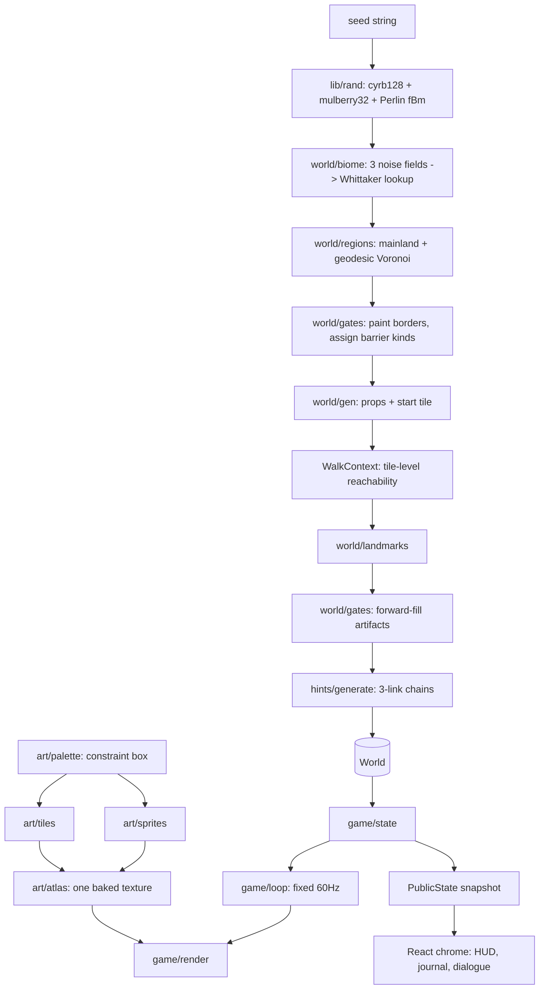

# Open Range Architecture

## Purpose

Open Range is a browser exploration game whose art and world are both generated
from a seed. It exists to solve one stated problem — terrain art that would not
hold a consistent look across biomes — by making coherence a property of the
generator rather than of curation.

Three concepts stay distinct:

- **Palette** constrains every colour the game can produce. Nothing draws with a
  literal colour.
- **World** is an immutable, pure function of a seed string: terrain, regions,
  gating, artifacts, landmarks, speakers.
- **Game state** is the small mutable layer on top: where the player stands, what
  they carry, what they have been told, what they have seen.

## System overview



Four layers:

1. **Art** — a constrained colour space, procedural tile and sprite painters, and
   a single atlas baked once at boot.
2. **World** — pure generation. Same seed in, byte-identical world out.
3. **Runtime** — fixed-timestep simulation, collision, camera, rendering.
4. **Presentation** — App Router routes and a thin React chrome that never
   participates in the frame loop.

## Repository layout

| Path | Responsibility |
| --- | --- |
| `lib/rand.ts` | Seeded PRNG, gradient noise, fBm, stable coordinate hash, content hash |
| `lib/art/palette.ts` | The constraint box, biome ramps, accents, UI and sprite colours |
| `lib/art/tiles.ts` | 16×16 terrain painters and directional transition bands |
| `lib/art/sprites.ts` | Characters, artifacts, landmarks, props |
| `lib/art/canvas.ts` | Surface creation and the shared outline post-pass |
| `lib/art/atlas.ts` | Shelf-packs every drawable into one texture |
| `lib/world/biome.ts` | Elevation, moisture, temperature → biome per tile |
| `lib/world/regions.ts` | Mainland selection, geodesic Voronoi, adjacency, naming |
| `lib/world/gates.ts` | Barrier painting, tile reachability, forward fill |
| `lib/world/landmarks.ts` | Named, recognisable features that hints can point at |
| `lib/world/names.ts` | Syllable grammar for regions, artifacts, people |
| `lib/world/gen.ts` | `generateWorld(seed)` — the single pure entry point |
| `lib/hints/grammar.ts` | Hint sentence templates |
| `lib/hints/generate.ts` | Speakers and three-link chains |
| `lib/game/*` | State, input, loop, render, save |
| `components/*` | Canvas host and React chrome |
| `scripts/*` | Headless preview renderers and a software canvas |

## The constraint box

`palette.ts` is the load-bearing file. Hue is confined to an earthy arc,
saturation is capped, lightness follows one curve shared by all biomes, and a
single atmosphere hue is mixed into everything — more strongly at the light end,
the way distance and sunlight tint a landscape.

A biome supplies a hue, a saturation and a lightness **offset**. Two consequences:

- Two biomes have identical internal contrast, because neither owns its curve.
- An off-style tile is not a mistake that can be made.

The atmosphere pull interpolates *linearly within* the hue band. Both endpoints
are inside a contiguous arc, so the result provably cannot leave it.

Biomes may declare an **accent** hue for small details — heather on a moor,
wildflowers in grass, blue shadow on snow. Accents resolve through the same box.
This is what lets a moor be olive-brown ground with purple flecks; making heather
the base hue produced lavender ground that clashed with every other biome.

## Tile drawing

Two rules keep the world from reading as a grid of coloured squares:

1. **Interiors are flat plus small marks, never a gradient.** A per-tile gradient
   cannot line up with its neighbour and the seams become a visible lattice.
2. **All blending happens in edge overlays** — a dithered band drawn in the
   *neighbour's* ramp, entering from one of four directions, with precedence from
   `TileSpec.rank`. Four masks per biome, not sixteen per biome pair; corner tiles
   simply receive two overlays.

Variants are selected by a stable hash of `(x, y)`, so terrain never shimmers as
the camera moves. The atlas is byte-identical on every machine.

## World generation order

```
terrain → mainland → regions → gates → props → start tile → landmarks → artifacts → speakers
```

The order is not arbitrary:

- **Props and the start tile precede artifacts**, because both change what is
  walkable and therefore where a key may legally be hidden.
- **Landmarks precede artifacts**, so an artifact can be anchored beside one. That
  is what makes "beneath the split oak" true by construction rather than something
  checked and repaired afterwards.
- **Artifacts precede speakers**, so each clue describes a location that exists.

Only the largest connected component of walkable land is used. Noise readily
produces offshore specks; as regions they would claim reachability that does not
exist. If the island is too small to host a progression, generation retries with
a derived seed (`seed#1`, `seed#2`, …) — still a pure function of the original.

Region territories grow by **multi-source breadth-first search**, not Euclidean
distance. Euclidean Voronoi cuts straight across bays, placing tiles in a region
unreachable from its own centre; growing by walking distance makes every region
internally connected by construction.

## Gating

The **entire border** between two regions is painted with one barrier terrain
(river, cliff, or bramble). This makes region-graph adjacency and actual walking
equivalent: there is no chokepoint to place and no gap for noise to leave open.
The first painted layer is always solid; layers beyond it are applied unevenly by
coordinate hash, so a border reads as a river or a ridge rather than a surveyed
canal.

Barrier kind comes from the **deeper** of the two regions' progression batches, so
entering a batch-*k* region always costs artifact *k* regardless of approach. Using
the shallower side left a back door.

Batches are assigned from breadth-first **order**, not breadth-first **depth**.
Depth seemed natural but fails: seven regions in a geodesic Voronoi form a dense
planar graph whose depth from any start is often only one or two, which silently
collapsed a three-artifact progression into one or two. Order always yields three
non-empty batches.

## Reachability is computed on tiles

This is the most important correctness decision in the project.

Reachability looked like it could be read off the region graph — borders are
painted in full, so crossing regions always means crossing a barrier. It cannot.
**Painting a border two tiles deep on both sides can cut a narrow region's
passable interior into disconnected pockets.** The graph still calls that region
reached, while a player standing in one pocket cannot walk to the other.

Placing a key in the wrong pocket produced genuinely unsolvable worlds. They were
found by a test that walks the tile grid independently rather than reusing the
generator's own graph — a graph-level check would have agreed with the bug.

Everything that decides placement now uses `reachableTiles`: forward fill,
speaker positions, and the ending region.

## Forward fill

```
carrying = {}
for each tier:
    reachable = flood fill from the start with `carrying`
    blocking  = barrier kinds touching that frontier
    kind      = first blocking kind in canonical order
    anchor    = a landmark inside `reachable`
    place the artifact beside `anchor`
    carrying += kind
```

Because the search space is exactly the ground already underfoot, a key is never
hidden behind the door it opens. `fill.test.ts` confirms this over 500 seeds; the
verification confirms the design rather than propping it up.

## The React boundary

The loop must never touch React. Game state is a plain mutable object in a
`useRef`; React receives a small `PublicState` snapshot, compared structurally,
and only when something a person could notice changes. The first snapshot is
published from inside the first animation frame, so the effect body never calls
`setState` synchronously.

Simulation runs at a fixed 60Hz with an accumulator, capped at five steps per
frame and with any remaining backlog discarded — returning to a backgrounded tab
must not simulate the gap. Rendering happens once per animation frame and does
nothing but blit from the atlas.

## Persistence

`localStorage`, Zod-validated, stamped with `WORLD_VERSION`. A save stores the
seed, position, collected artifacts, heard clues, and a run-length-encoded
visited bitmap — everything else is re-derived, keeping saves under 4KB.

A save is refused unless both the seed **and** the world content hash match.
Coordinates and artifact ids are meaningless against a different map, and
silently accepting them would drop the player into the sea. Bumping
`WORLD_VERSION` discards old saves rather than loading them against a world that
no longer matches — the same instinct as an immutable model version.

## Testing

| Suite | Asserts |
| --- | --- |
| `rand.test.ts` | Seed determinism, stream decorrelation, noise smoothness, hash uniformity |
| `art/palette.test.ts` | Every colour the game can draw sits inside the constraint box; all biomes share one contrast shape |
| `world/fill.test.ts` | 500 worlds completable by an independent tile walk; no key behind its own door; land never touches the map edge |
| `hints/hints.test.ts` | Every clue is true of its world; every chain is reachable before its artifact; referrals name real people in real places |
| `game/save.test.ts` | Round trip, RLE correctness, refusal of mismatched worlds, size ceiling |
| `game/playthrough.test.ts` | Five worlds played end to end through the real loop: pathfinding with real collision, talking, collecting, reaching the summit |

`scripts/canvas-shim.ts` implements just enough of Canvas2D to run the real art
pipeline in Node, which is what lets the previews and checks work headlessly.

## Extension points

The boundaries that should be preserved by anything added later: generation stays
a pure function of the seed, placement decisions stay keyed to tile reachability,
and every colour keeps arriving from the palette rather than from a literal.

Natural next steps that fit those boundaries:

- Dungeons as separate seeded sub-worlds sharing the atlas and palette.
- Enemies and combat, as entities in the existing y-sorted draw list.
- Generated audio, seeded from the same world seed.
- Touch controls, as another producer for `InputState`.
- A shareable in-game map screen, drawn from `visited` and `regionOf`.
